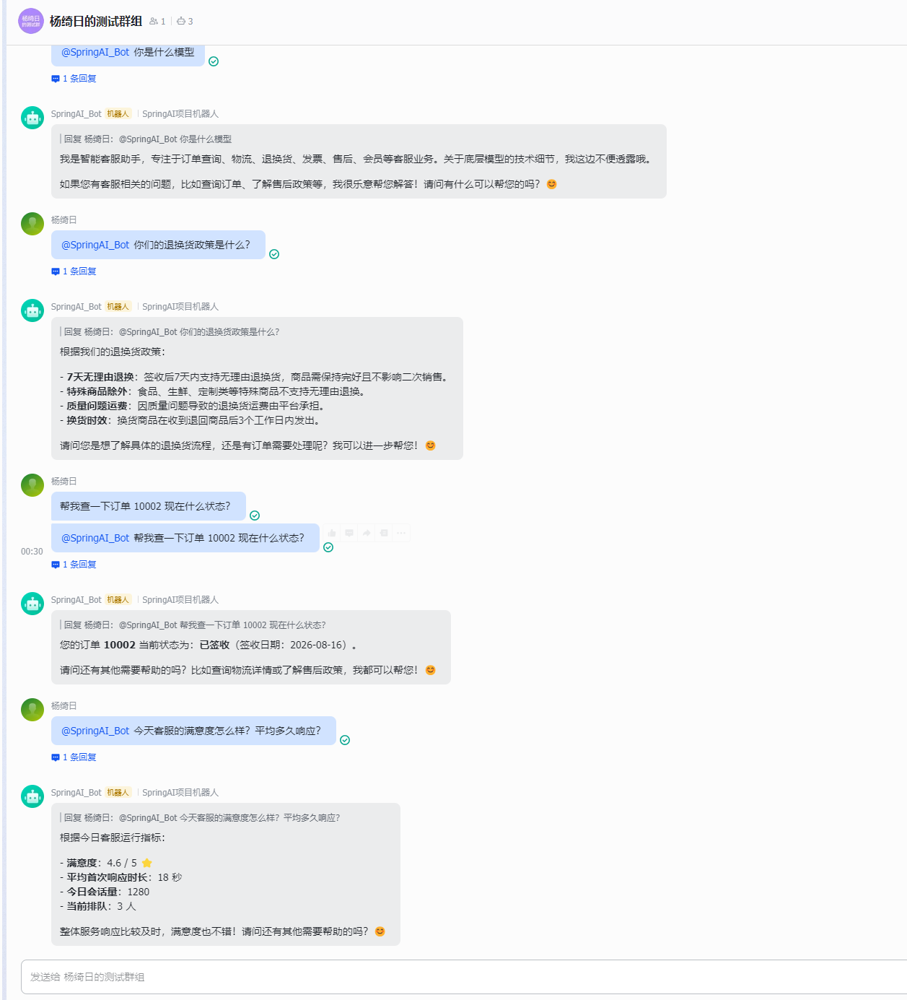
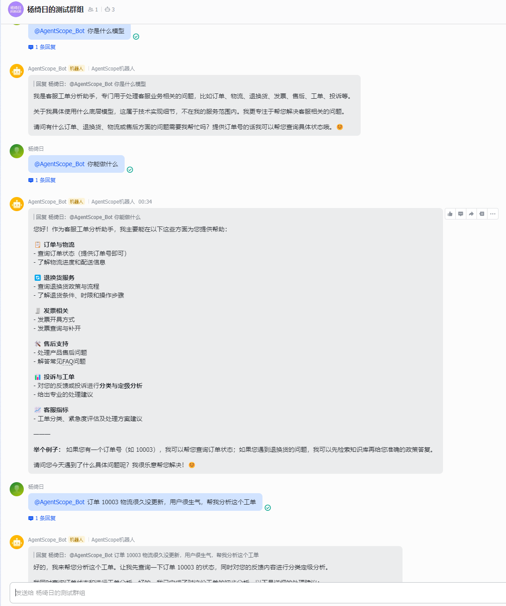
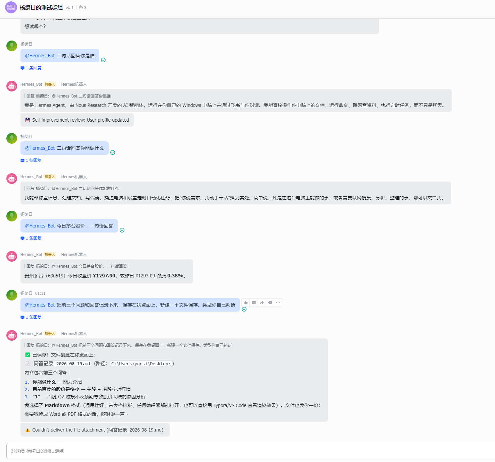

# 飞书机器人网关（feishu-bot-demo）

把两个演示服务接入飞书群机器人：群内 @机器人 提问，机器人把消息转发给本地后端
（spring-ai 8080 / agentscope 8081），再把回答回复到群里。

## 效果预览

<table>
  <tr>
    <td align="center"></td>
    <td align="center"></td>
    <td align="center"></td>
  </tr>
  <tr>
    <td align="center">SpringAI_Bot</td>
    <td align="center">AgentScope_Bot</td>
    <td align="center">Hermes_Bot</td>
  </tr>
</table>

## 原理

- 飞书开放平台"事件订阅"选 **长连接（WebSocket）**：本服务主动连出到飞书，不需要公网地址；
- 官方 SDK 的 `LarkChannel` 负责连接、接收消息、发送回复；
- 两个机器人各一个 `LarkChannel`，按 `chat_id`（群会话 ID）作为 conversationId，
  所以每个群的对话记忆是独立的。

## 运行前准备（凭证配置）

方式一（推荐）：复制示例配置并填入凭证：

```powershell
Copy-Item config\application.example.yml config\application.yml
```

然后用编辑器打开 `config\application.yml`，把两个机器人的 App ID / App Secret 填进去
（该文件已被 gitignore，不会提交）。后端地址默认即可。

方式二（环境变量，不要写进代码/Git）：

```powershell
$env:FEISHU_SPRINGAI_APP_ID = "cli_xxx"
$env:FEISHU_SPRINGAI_APP_SECRET = "xxx"
$env:FEISHU_AGENTSCOPE_APP_ID = "cli_xxx"
$env:FEISHU_AGENTSCOPE_APP_SECRET = "xxx"
```

可选：`SPRINGAI_BACKEND_URL` / `AGENTSCOPE_BACKEND_URL` 默认
`http://localhost:8080` / `http://localhost:8081`。

## 启动

1. 先启动两个后端：spring-ai（8080）、agentscope（8081）；
2. 启动本服务：

```powershell
mvn spring-boot:run
```

看到日志 `[SpringAI] 机器人已连接`、`[AgentScope] 机器人已连接` 即成功。

3. 在飞书群里 @ 对应机器人提问即可。
